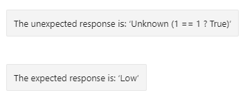

# Language Generation Switch issue

This code highlights an issue with the [Switch template](https://docs.microsoft.com/en-us/azure/bot-service/file-format/bot-builder-lg-file-format?view=azure-bot-service-4.0#switch-template) not correctly matching the case.

The input value to the switch template is an integer named `score`. The sample uses a default value of `1`. It appears the Switch template doesn't match a case, even though the values match and are of the same type. This is demonstrated by the default response.

## Unexpected result
The unexpected response is `Unknown (1 == 1 ? True)`. This demonstrates that `score` equals 1, even though the Switch template thinks otherwise.

## Expected result
The response should result in the text `Low`.